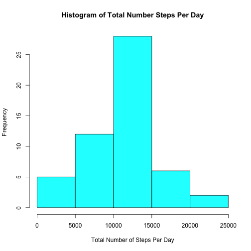
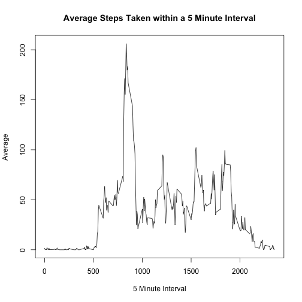
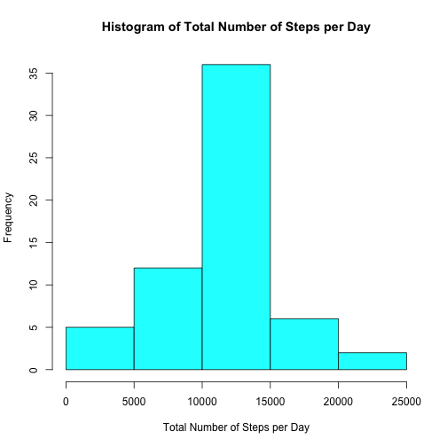
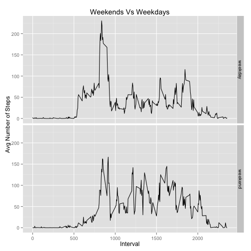

# Course Project 1 for Coursera's Reproducible Research

### Loading and preprocessing the data


```r
# divide data into clean clean data and raw data
# raw data
  mydata <- read.csv("activity.csv")
# clean data
  activitydata <- na.omit(mydata)
# Change dates to correct format
  library(dplyr)
  mydata$date <- as.Date(mydata$date)
  activitydata$date <- as.Date(activitydata$date)
```

### What is mean total number of steps taken per day?


```r
  # since day is the most granular in the date columnn, grouping by date will group by day
stepsday <- activitydata %>% group_by(date) %>% summarize(totalsteps=sum(steps))
# histogram of total steps per day  
  hist(stepsday$totalsteps, 
     xlab="Total Number of Steps Per Day", 
     ylab="Frequency", 
     main="Histogram of Total Number Steps Per Day",
     col=5)
```

 

```r
# Mean 
  meansteps <-mean(stepsday$totalsteps)  
# Median
  mediansteps <- median(stepsday$totalsteps)
```

* The mean is 1.0766189 &times; 10<sup>4</sup> and the median is 10765 for total number of steps per day.

### What is the average daily activity pattern?

```r
fiveminavg <- activitydata %>% group_by(interval) %>% summarize(avgsteps=mean(steps))
plot(fiveminavg$interval,fiveminavg$ avgsteps, 
     type="l",
     xlab="5 Minute Interval",
     ylab="Average",
     main="Average Steps Taken within a 5 Minute Interval")
```

 

```r
maxinterval <- fiveminavg$interval[which.max(fiveminavg$avgsteps)]
```

* The max interval is 835

### Imputing missing values


```r
# calculate missing values
navalues <- sum(is.na(mydata$steps))
```

* There are 2304 missing values in the activity dataset.


```r
# find index and replace with the 5 min average
newdata <- mydata
for (i in 1:nrow(newdata)) {
    if (is.na(newdata$steps[i])) {
        fill <- which(newdata$interval[i] == fiveminavg$interval)
        newdata$steps[i] <- fiveminavg[fill,]$avgsteps
    }
}

# like the first dataset now plot histogram and look at mean and median to see if there is any difference
  #first summarize the data
newstepsday <- newdata %>% group_by(date) %>% summarize(totalsteps=sum(steps))

hist(newstepsday$totalsteps, 
     xlab="Total Number of Steps per Day", 
     ylab="Frequency", 
     main="Histogram of Total Number of Steps per Day",
     col=5)
```

 

```r
newmeansteps <- mean(newstepsday$totalsteps)
newmediansteps <- median(newstepsday$totalsteps)
```

* The mean is 1.0766189 &times; 10<sup>4</sup> and the median is 1.0766189 &times; 10<sup>4</sup> for the new data the replaces null values with averages.

### Are there differences in activity patterns between weekdays and weekends?

```r
# Make weekday variable and then replace all weekends into weekend type
newdata$day <- weekdays(newdata$date)
newdata$daytype <- "weekday"
newdata$daytype[newdata$day %in% c("Saturday", "Sunday")] <- "weekend"

# Summarize data by daytype
dayaverage <- newdata %>% group_by(daytype, interval) %>% summarize(avgsteps=mean(steps))

# Now plot the relationships utilizing the ggplot2 package
library(ggplot2)
qplot(interval, avgsteps, data=dayaverage,
      type="l",
      geom="line",
      xlab="Interval",
      ylab="Avg Number of Steps",
      main="Weekends Vs Weekdays",
      facets = daytype ~ .)
```

 

```r
dayaverageweekday <- subset(dayaverage, dayaverage$daytype == "weekday")
dayaverageweekend <- subset(dayaverage, dayaverage$daytype == "weekend")
stddevweekday <- sd(dayaverageweekday$avgsteps)
stddevweekend <- sd(dayaverageweekend$avgsteps)
```
* The main difference is that weekends aren't as active earlier. 

